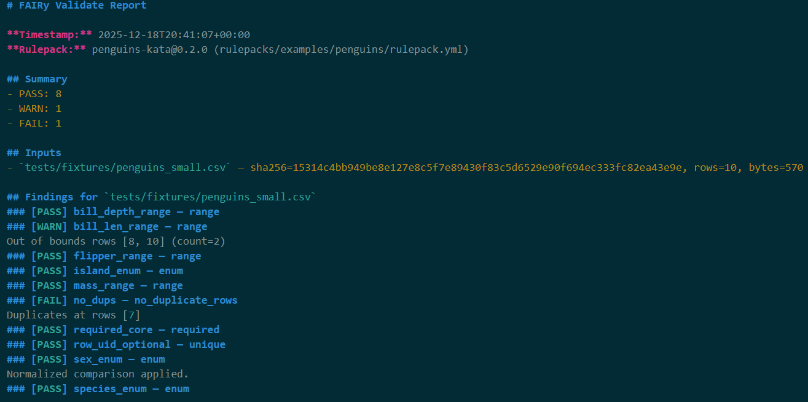

<!-- Project badges -->
[](LICENSE)
[](rulepacks/examples/LICENSE)
[](#)
[](.pre-commit-config.yaml)

# FAIRy Core
Local-first validator and packager for FAIR-compliant research datasets.

**Why FAIRy**
- **Local-first**: All processing is on your machine. Your raw and fixed data never leave without your consent.
- **Extensible**: Add new repository templates or contribute improved schemas/rules — keep up with evolving standards.
- **Practical**: Catch real submission pain points (dates, IDs, vocab, file names), export clean packages, avoid resubmission headaches.

**What’s in this repo**
This repo contains the **core validation engine** and **CLI** (e.g., `fairy preflight`, `fairy validate`).

- ✅ Validates tabular metadata against repository-specific **rulepacks**
- ✅ Emits **machine-readable** (JSON) and **human-readable** (Markdown) reports
- ✅ Writes **attestation & provenance**, with optional export bundle (zip)
- 🧪 Includes intentionally "failing" fixtures for smoketests
- 🚧 Early alpha; interfaces may change prior to v1.0

> 💡 **Want the full UI experience?** For project workspaces, guided fixes, visual workflows, and demo examples, see [**fairy-lab**](https://github.com/yuummmer/fairy-lab) — a Streamlit-based demo tenant that uses this core engine.
---
## Quick look

**Validate (CLI)**

---
## Try it in 60 seconds
This produces a Markdown file for the penguins kata like the screenshot above.

```bash
python -m venv .venv && source .venv/bin/activate
pip install -e .
mkdir -p .tmp

fairy validate \
  --rulepack rulepacks/examples/penguins/rulepack.yml \
  --inputs default=tests/fixtures/penguins_small.csv \
  --report-json .tmp/penguins_report.json \
  --report-md .tmp/penguins_report.md

less .tmp/penguins_report.md   # press q to quit

# (Optional) Open in VS Code if you have it:
code .tmp/penguins_report.md
```
---
## Choose your path

- **UI (fairy-lab)**: local project workspaces, guided fixes, visual workflow, export bundles.
  → https://github.com/yuummmer/fairy-lab

- **CLI (this repo)**: run `fairy preflight` / `fairy validate` against a rulepack, review JSON/Markdown reports, iterate until submission-ready.

---
## Quickstart

```bash
# 0) Python 3.10+
python -m venv .venv && source .venv/bin/activate
pip install -e .

# 1) Check CLI
fairy --help
fairy --version

# 2) (Optional) Rulepack schema validation (example penguins rulepack)
python -m fairy.cli rulepack --rulepack rulepacks/examples/penguins/rulepack.yml

```
---
## 📦 Rulepacks

FAIRy-core is the **engine**. Rulepacks are **versioned and released independently** in separate CC0 repos.

- **Rulepack registry (recommended start here):** `yuummmer/fairy-rulepack-registry`
  Machine-readable index of available rulepacks + versions.
- **GEO rulepacks:** `yuummmer/fairy-rulepacks-geo`
  - `geo_bulk_seq` (available)
  - `geo_single_cell` (planned)

This repo (`fairy-core`) includes only small **example/kata** rulepacks under `rulepacks/examples/` for learning and tests.

### 🗂️ Rulepack registry

Official (and community) rulepacks are tracked in **fairy-rulepack-registry**. Tools (and FAIRy Lab) can use this to discover rulepacks.

- 📌 Machine-readable list of rulepack repos + versions (so tools can discover them)
- ✅ Schema-validated via CI (prevents broken entries)
- 🧭 Use it to find the latest GEO/ENA/etc rulepacks without hunting across GitHub

### Example: GEO bulk RNA-seq (external rulepack repo)

```bash
# Get the GEO rulepack repo (CC0)
git clone https://github.com/yuummmer/fairy-rulepacks-geo.git

# Run preflight using its fixtures
mkdir -p .tmp

fairy preflight \
  --rulepack .deps/fairy-rulepacks-geo/rulepacks/geo_bulk_seq/v0_2_0.json \
  --samples  .deps/fairy-rulepacks-geo/rulepacks/geo_bulk_seq/fixtures/samples.tsv \
  --files    .deps/fairy-rulepacks-geo/rulepacks/geo_bulk_seq/fixtures/files.tsv \
  --out      .tmp/geo_bulk_seq_report.json

# View outputs:
ls .tmp/
cat .tmp/geo_bulk_seq_report.md | head -n 80  # or open in your editor

```
**Available rule types:** `required`, `unique`, `enum`, `range`, `dup`/`no_duplicate_rows`, `foreign_key`, `url`, `non_empty_trimmed`, `regex`

See [Rule types reference](./docs/rule-types.md) for complete documentation on all rule types and their configuration options.
---
## Reports

- **JSON**: Structured v1.0.0 schema reports with deterministic ordering (see [`schemas/preflight_report_v1.schema.json`](schemas/preflight_report_v1.schema.json) and [`docs/reporting.md`](docs/reporting.md))
- **Markdown**: Curator-friendly one-pager (generated alongside JSON)
- **Exit code**: 0 if no FAIL, else 1

---

## Documentation

For full documentation, see the [`docs/`](./docs) folder:

- [Getting started](./docs/getting-started.md)
- [CLI usage](./docs/cli.md)
- [Parameter files](./docs/params.md)
- [Reporting](./docs/reporting.md)
- [Kata gallery](./docs/katas/index.md)

---

## Development
```bash
pip install -e ".[dev]"
pytest -q
ruff check . --fix
ruff format .
```
### Developer notes
- Source files use SPDX headers:
```python
# SPDX-License-Identifier: AGPL-3.0-only
# Copyright (c) 2025 Jennifer Slotnick
```
- We package rulepacks as package data:
```toml
[tool.setuptools.package-data]
fairy = ["rulepacks/**/*.json","rulepacks/**/*.yaml","rulepacks/**/*.yml"]

```
- Local artifacts to ignore are preconfigured (.tmp/, .venv/, __pycache__/).


- Coverage config: .coveragerc, pytest.ini
- Demo fixtures: tests/fixtures/*, demos/
---

## Repo layout
```bash
src/fairy/
  cli/         # CLI entrypoints (validate, preflight, rulepack)
  core/        # services/models/validators (evolving)
  rulepack/    # loader + schema (YAML)
  rulepacks/
    examples/    # small kata/example rulepacks (CC0)
demos/         # demo rulepacks / scratch data (not shipped)
tests/         # unit + smoke tests
decisions/     # Architecture Decision Records (ADRs)

```

See [Architecture Decision Records](decisions/README.md) for major design decisions and rationale.
---

## License

FAIRy-core uses a mixed licensing model:

- **Core engine code** (`src/fairy/**`):
  Licensed under **AGPL-3.0-only**. See [`LICENSE`](./LICENSE).

- **Example/kata rulepacks** (`rulepacks/examples/**`):
  Licensed under **CC0-1.0**. See [`rulepacks/examples/LICENSE`](./rulepacks/examples/LICENSE).

- **Official public rulepacks** (separate repos, e.g. `fairy-rulepacks-geo`):
  Licensed under **CC0-1.0** (each repo includes its own LICENSE).

- **Samples and fixtures** (e.g. `samples/**`, `tests/fixtures/**`):
  Licensed under **CC BY-4.0** (documented per folder).

Commercial licensing for FAIRy-core is available for organizations that
cannot adopt AGPL. See [`COMMERCIAL.md`](./COMMERCIAL.md) or contact
**hello@datadabra.com**.

---


---

## Contributing
We welcome contributions! See [`CONTRIBUTING.md`](./CONTRIBUTING.md) for guidelines on:
- How to get started (forking, setup, making changes)
- Ways to contribute (rulepacks, tests, documentation, engine improvements)
- Specs and PRDs for major features
- Licensing of contributions

For information about maintainer roles and module stewards, see [`MAINTAINERS.md`](./MAINTAINERS.md).

---

## Citation

If you use FAIRy in a project, demo, or talk, please cite:

FAIRy (v0.2). Local-first validator for FAIR research data.
FAIRy-core (engine): https://github.com/yuummmer/fairy-core
FAIRy Lab (UI & labs): https://github.com/yuummmer/fairy-lab
---

## Roadmap
- Rulepack adapters (aliases, NA sentinels, regex/type coercions, unit enums)
- Multi-input CLI UX (auto-detect TSV/CSV, merge on sample_id)
- Richer provenance + determinism tests (goldens)
- Export bundle CLI command (currently available via Python API)
---

## Who FAIRy is for

- Researchers and lab teams tired of “submission rejected → fix → resubmit” loops.
- Anyone handling sensitive/pre-publication data who needs local-first validation.
- Curators and institutions who want consistent, transparent, hackable validation templates.
---
## Pilots / institutional use

Institutions and labs interested in pilots or dashboards — we’d love to hear from you.
Email **hello@datadabra.com** or open an issue labeled `pilot-inquiry`.
